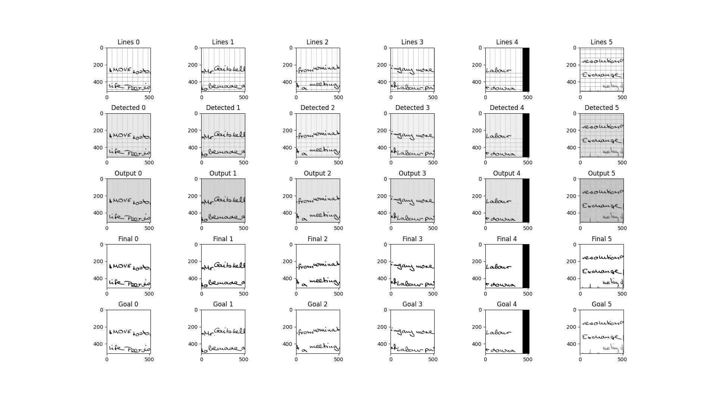

# Line Remover NN 🚀

> [!CAUTION]
> This V2 version of the project is a complete rewrite from scratch. It uses a more modern stack, a single main file instead of individual files and better file tree.
> It is experimental and subject to changes. The current model already seems more powerful than the last one but I still need to train it for longer and make it even stronger against big page transformations.

## Introduction

This repos uses PyTorch to remove ruled lines from an image while reconstructing overlapping characters with lines.
The goal of this model is to make easier the word recognition from OCR.

## Installation

Required:
🐍 `python >3.10` Recommended: python 3.14.
UV Package manager.
CUDA. If you have amd gpu idk i dont have one.

### Install Dependencies

`sudo apt install libopencv-dev`

`bash ./dev-install.sh` Builds the cpp page generation module.

`uv sync`

### Install IAM Dataset 🗒️

`uv run lineremovernn download-dataset -d iam`

### Generate synthetic pages

`uv run lineremovernn generate-pages -n 15000 -a`
`-a` is for adding arcs instead of straight lines.

You can preview the generated datasets with
`uv run lineremovernn preview-dataset -n 5 -d pages`

## Train Model 🧑‍🏫

Run `uv run lineremovernn train -e 25 -l -b 6`
`-l` to load a before trained model (to continue training)

## Other commands:

`uv run lineremovernn ls-models` to list models.
`uv run lineremovernn model-info` to show the model arch.
`uv run lineremovernn test -n 5` to test a model agaisnt some dataset pages.

## Usage

No lib for the moment.
You can use the gui:
`uv run lineremovernn gui-infer`
