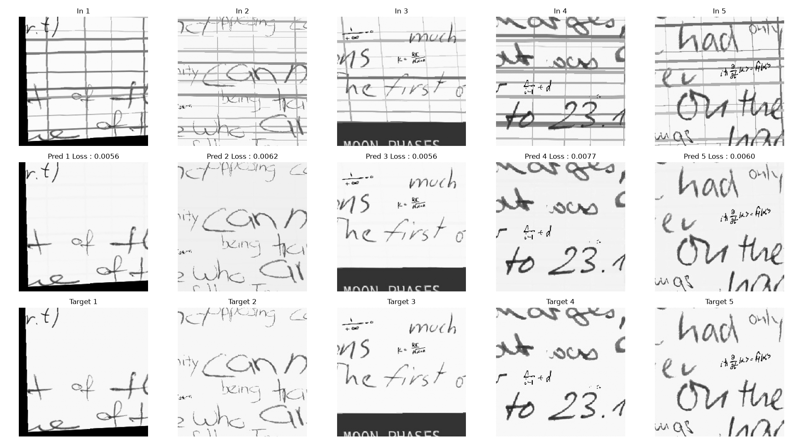

# Line Remover NN

[](https://github.com/PastaLaPate/LineRemoverNN "Go to GitHub repo")
[](https://github.com/PastaLaPate/LineRemoverNN)
[](https://github.com/PastaLaPate/LineRemoverNN)
[](#license)
[](https://github.com/PastaLaPate/LineRemoverNN/issues)

> [!NOTE]
> This is the new v2 version of the project (complete rewrite), to see the old version go to the `legacy` branch.

## Introduction

This repos uses PyTorch to remove ruled lines from an image while reconstructing overlapping characters with lines.
The goal of this model is to make easier the word recognition from OCR.



## Installation

### Prerequisites

- [Pixi](https://pixi.prefix.dev/latest/installation/) (cpp dependencies manager)
- [UV](https://docs.astral.sh/uv/getting-started/installation/) (python dependencies manager)
- Nvidia GPU with CUDA support (I cant test AMD ROCm)

### Setup Environment

```bash
# Install CMake, opencv, cairo, compile cpp etc...
pixi install

# Install pre-commit hooks
pixi run hooks

# Generate compile_commands.json
pixi run clangd-setup
```

## Quickstart

### Install Datasets

These commands automatically download and extract popular datasets.

#### IAM

```bash
pixi run lineremovernn download-dataset -d iam
```

#### Mathwriting

```bash
pixi run lineremovernn download-dataset -d mathwriting
```

#### AI2D

```bash
pixi run lineremovernn download-dataset -d ai2d
```

### Generate synthetic pages


> [!NOTE]
> Using IAM's dataset RAM Preloading + Indexing if you can can speed up generation by ~300% (~100ms per page to ~28ms).

```bash
pixi run lineremovernn generate-pages [OPTIONS]
```

| Option                     | Type      | Help                                                                                                                        |
| -------------------------- | --------- | --------------------------------------------------------------------------------------------------------------------------- |
| `-n`, `--n`                | `INTEGER` | Number of images to generate                                                                                                |
| `--datasets`               | `STRING`  | Space-separated datasets, proportions and flags (`p` for RAM preloading, `i` for indexing). E.g. `iam:1:ip mathwriting:0.3` |
| `-d`, `--docs`             | `FLAG`    | Make document like layouts instead of one big chunk of paragraph.                                                           |
| `-a`, `--a`                | `FLAG`    | Use arcs instead of straight lines                                                                                          |
| `-il`, `--imperfect-lines` | `FLAG`    | Add noise to the lines.                                                                                                     |
| `-mw`, `--max-warp`        | `FLOAT`   | Maximum perspective warp factor for word crops (0.0 to disable, recommended: 0.15)                                          |
| `-m`, `--save-metadata`    | `FLAG`    | Export ground-truth word layout coordinates as XML files.                                                                   |
| `-w`, `--workers`          | `INT`     | CPU threads to use (default: all cores)                                                                                     |
| `-db`, `--debug`           | `FLAG`    | Debug how long each process of page generating is.                                                                          |

### Train Model

```bash
pixi run lineremovernn train [OPTIONS]
```

| Option               | Type   | Help                                            |
| -------------------- | ------ | ----------------------------------------------- |
| `-e`, `--epoch`      | `INT`  | Number of epochs to train the model for.        |
| `-b`, `--batch-size` | `INT`  | Batch size.                                     |
| `-l`, `--load`       | `FLAG` | Continue training of latest model.              |
| `-ex`, `--extended`  | `FLAG` | Use extended dataset augmentation & transforms. |

## Utils commands:

### List available models

```bash
pixi run lineremovernn ls-models
```

### Model layers

```bash
pixi run lineremovernn model-info
```

### Test model

```bash
pixi run lineremovernn test
```

| Option               | Type   | Help                      |
| -------------------- | ------ | ------------------------- |
| `-n`, `--n`          | `INT`  | Number of images to test. |
| `-b`, `--batch-size` | `INT`  | Batch size.               |
| `-l`, `--loss`       | `FLAG` | Show loss for each image. |

### Preview dataset

```bash
pixi run lineremovernn preview-dataset
```

| Option              | Type   | Help                                 |
| ------------------- | ------ | ------------------------------------ |
| `-n`, `--n`         | `INT`  | Number of images to test.            |
| `-d`, `--dataset`   | `STR`  | Dataset to preview available: pages. |
| `-t`, `--transform` | `FLAG` | Add some random transforms.          |

## GUI Infer

No python lib for the moment.
You can use the gui:

```bash
pixi run lineremovernn gui-infer
```

## Development

To force rebuild of CPP bindings (src/lineremovernn_ext), use:

```bash
pixi run build
```

## License

Copyright (C) 2026 PastaLaPate.

This project uses:
Barkeep - Licensed under the Apache License, Version 2.0 by Ozan İrsoy.
Pugixml - Licensed under the MIT License by Arseny Kapoulkine.

This project is licensed under the GNU Affero General Public License v3 (AGPLv3) - see the [LICENSE](LICENSE) file for details.
