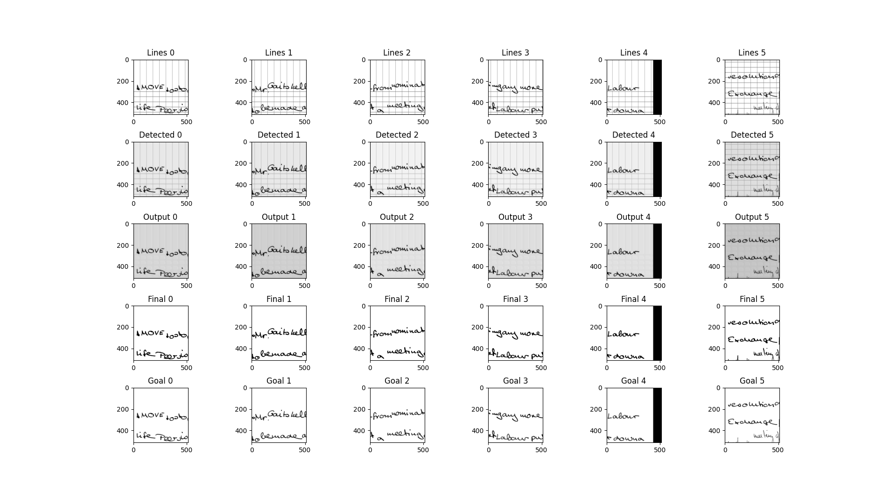

# Line Remover NN 🚀

## Introduction

This repos uses PyTorch to remove ruled lines from an image while reconstructing overlapping characters with lines.
The goal of this model is to make easier the word recognition from OCR

## Requirements

🐍 `python >3.9` (not sure need testing)

### Install Requirements

`python -m pip install -r requirements.txt`

### Install IAM Dataset 🗒️

First go to `/data/` and run `python downloadData.py`

### Preprocess the data (generated pages and split pages to blocks)

#### Generate synthetic pages

Stay in `/data/` directory and run `python MakeDataset.py --output [output default: ./] --pages [number of pages to generate default: 1000] --split [split or no directly the pages default: False]`

#### Split pages into blocks (of 512x512) (Not necessary if --split was specified earlier)

Run `python processBlock.py --dir [directory where pages are and where will they be generated default: ./]`

## Train Model 🧑‍🏫

Run `python train.py --epoch [number of epochs to train default: 50] --dataset [dataset path] ?--load[Load or not the best saved model]`

## Usage

You can use `infer.py` functions such as:
processImg,
processImgs,
splitAndProcessImg
See docs directly on functions descs,

## Inspiration

Model Structure : [Gold, C., Zesch, T. (2022). CNN-Based Ruled Line Removal in Handwritten Documents. In: Porwal, U., Fornés, A., Shafait, F. (eds) Frontiers in Handwriting Recognition. ICFHR 2022](https://doi.org/10.1007/978-3-031-21648-0_36)

Word Recognition model for Eval : [MLTU Tutorials](https://github.com/pythonlessons/mltu/tree/main/Tutorials/08_handwriting_recognition_torch)
